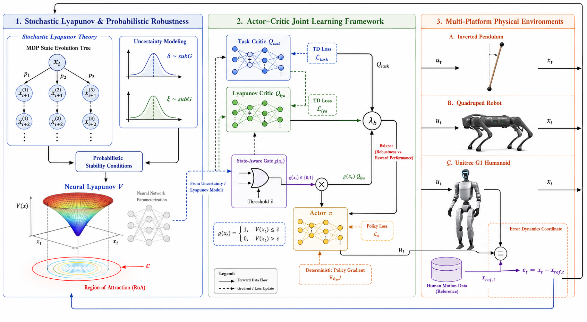

# robust-NLFRL

[项目主页](https://detachedcat.github.io/robust-NLFRL/) | [English README](README.md)

在 Unitree G1 上实现**可认证鲁棒运动控制**的仿真代码：将**概率神经 Lyapunov 函数**嵌入 Actor–Critic 强化学习流程（AMP + `LyaPPO`）。



## 代码来源与范围说明

本项目在开源仓库 **[ccrpRepo/AMP_mjlab](https://github.com/ccrpRepo/AMP_mjlab)**（基于 mjlab + rsl_rl 的 G1 AMP 运动控制栈）之上开发，感谢上游作者的开源工作。

| | 上游 (`ccrpRepo/AMP_mjlab`) | 本仓库 (`robust-NLFRL`) |
|---|---|---|
| 侧重点 | G1 AMP 运动控制基础设施 | **概率神经 Lyapunov + RL** 鲁棒速度跟踪 |
| 主要任务 | `Unitree-G1-AMP-Flat` / `Rough` | **`Unitree-G1-LYA-Flat`** |
| 新增模块 | — | TCLF 联合训练、概率稳定性正则、认证 RoA |

**说明：** 上游仓库可能包含更宽泛的运动能力探索。**本仓库聚焦可认证鲁棒 locomotion（速度跟踪）**，不以跌倒起身（fall-and-get-up）为主要目标。

上游部署集成代码仍在 [ccrpRepo/wbc_fsm](https://github.com/ccrpRepo/wbc_fsm) 的 `MJAmp State` 中。

## 核心特点

- 在 sub-Gaussian 不确定性假设下建立概率 Lyapunov 条件（动力学 + 状态估计）
- Twin Control Lyapunov Function（`TCLF`）与策略通过 `LyaPPO` 端到端联合训练
- 状态感知门控，在任务奖励与 Lyapunov 鲁棒惩罚之间动态平衡
- 基于 mjlab + 内置 `rsl_rl` fork；训练与回放支持 ONNX 导出

## 环境要求

- Linux
- Python 3.11（建议）
- 可用的 MuJoCo / GPU 环境

```bash
pip install "warp-lang>=1.12.0,<1.13"
```

## 快速开始

### 1. 安装

```bash
conda activate mjlab
cd robust-NLFRL
python -m pip install -e .
pip install -e ./rsl_rl
```

参考：[mjlab](https://github.com/mujocolab/mjlab)、[unitree_rl_mjlab](https://github.com/unitreerobotics/unitree_rl_mjlab)。

### 2. 应用 mjlab 补丁（可选）

若不应用补丁，需在配置中移除 `history_ordering`。

```bash
cp mjlab_patch/mjlab/managers/observation_manager.py \
  $(python -c "import mjlab, os; print(os.path.dirname(mjlab.__file__))")/managers/observation_manager.py
```

### 3. 查看任务

```bash
python scripts/list_envs.py --keyword LYA
```

| 任务 ID | 说明 |
|---|---|
| `Unitree-G1-LYA-Flat` | **本仓库方法** — AMP + 概率神经 Lyapunov（平地） |
| `Unitree-G1-AMP-Flat` | AMP 基线（平地） |
| `Unitree-G1-Flat` | 纯 PPO 速度跟踪基线（无 AMP） |

## 训练

```bash
python scripts/train.py Unitree-G1-LYA-Flat --env.scene.num-envs=4096
```

日志目录：`logs/rsl_rl/g1_lya_locomotion/<时间戳_run>/`

完整 CLI 参数见 [scripts/README_trainArgs.md](scripts/README_trainArgs.md)。

## 评估与可视化

```bash
python scripts/play.py Unitree-G1-LYA-Flat \
  --checkpoint-file logs/rsl_rl/g1_lya_locomotion/<run_dir>/model_<iter>.pt
```

## 运动数据

AMP/LYA 任务需要 `src/assets/motions/g1/amp/WalkandRun` 下的 NPZ 文件。

```bash
python scripts/csv_to_npz.py --help
```

## 目录说明

- `src/tasks/amp_lya/` — Lyapunov 增强 AMP 任务（`Unitree-G1-LYA-Flat`）
- `src/tasks/amp_loco/` — AMP 运动环境（与上游共享）
- `rsl_rl/algorithms/lya_ppo.py` — 含 TCLF 的 `LyaPPO`
- `rsl_rl/algorithms/neural_lyapunov/` — Twin Control Lyapunov Function
- `docs/` — 项目主页资源（GitHub Pages）

## 致谢

- [ccrpRepo/AMP_mjlab](https://github.com/ccrpRepo/AMP_mjlab) — 本工作所扩展的 G1 AMP mjlab 基线代码
- [unitreerobotics/unitree_rl_mjlab](https://github.com/unitreerobotics/unitree_rl_mjlab)
- [Open-X-Humanoid/TienKung-Lab](https://github.com/Open-X-Humanoid/TienKung-Lab) — `rsl_rl` 中 AMP 实现的参考
